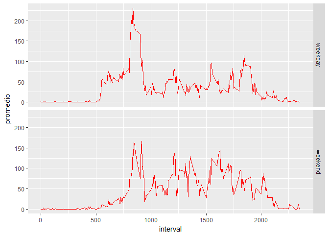

# Reproducible Research: Peer Assessment 1


## Loading and preprocessing the data


```r
setwd("~/2.EDUCATION/DataScience/ReproducibleResearch/RepData_PeerAssessment1")
unzip("activity.zip")
library(foreign)
act.data <- read.csv("activity.csv")
```


## What is mean total number of steps taken per day?


```r
require(dplyr)
day.steps <- act.data %>% group_by(date) %>% summarise(sum(steps, na.rm = TRUE))
names(day.steps)[2] <- "steps"
mean.day.steps <- mean(day.steps$steps, na.rm = TRUE)
median.day.steps <- median(day.steps$steps, na.rm = TRUE)
```

The average total number of steps taken per day is 9354.2295082 steps and the median is 10395 steps.

This is the histogram of the total steps taken daily: 


```r
library(ggplot2)
g <- ggplot(day.steps, aes(x = steps)) + geom_histogram()
g <- g + geom_vline(aes(xintercept = mean(steps, na.rm = TRUE)), color = "red", linetype = "dashed", size = 1, show.legend = TRUE) + geom_vline(aes(xintercept = median(steps, na.rm = TRUE)), color = "blue", linetype = "dashed", size = .5, show.legend = TRUE) + scale_color_manual(name = "statistics", values = c(median = "blue", mean = "red")) 
g <- g + ggtitle("Number of Steps Taken by Day") + theme(plot.title = element_text(lineheight=.8, face="bold"))
g
```

<!-- -->

## What is the average daily activity pattern?

```r
interval.steps <- act.data %>% group_by(interval) %>% summarise(mean(steps, na.rm = TRUE))
names(interval.steps)[2] <- "mean.steps"
max <- interval.steps[which.max(interval.steps$mean.steps),]
```


The time series of the 5-min interval and the average number of steps taken looks like this:


```r
q <- ggplot(interval.steps, aes(x=interval, y=mean.steps)) + geom_line(colour= "blue")
q
```

<!-- -->

An the 5-minute interval that contains the maximum number of steps (on average across all the days in the dataset) is interval 835 min, with 206.1698113 steps.


## Imputing missing values

The number of rows with missing values is 2304. 


Imputing missing values and new dataset: 


```r
library(plyr)
act.data.filled <- act.data
act.data.filled$newsteps <- act.data.filled$steps
mergedata <- merge(act.data.filled, interval.steps, by = "interval")
son.na <- is.na(mergedata$newsteps)
mergedata[son.na, "newsteps"] <- mergedata[son.na,"mean.steps"]
head(mergedata)
```

```
##   interval steps       date newsteps mean.steps
## 1        0    NA 2012-10-01 1.716981   1.716981
## 2        0     0 2012-11-23 0.000000   1.716981
## 3        0     0 2012-10-28 0.000000   1.716981
## 4        0     0 2012-11-06 0.000000   1.716981
## 5        0     0 2012-11-24 0.000000   1.716981
## 6        0     0 2012-11-15 0.000000   1.716981
```


```r
detach(package:plyr)    
library(dplyr)
day.steps2 <- mergedata %>% group_by(date) %>% summarise(suma.nueva = sum(newsteps))
```

Histogram:


```r
j <- ggplot(day.steps2, aes(suma.nueva)) + geom_histogram(bins = 50)
j <- j + geom_vline(aes(xintercept = mean(suma.nueva)), color = "red", linetype = "dashed", size = 1, show.legend = TRUE) + geom_vline(aes(xintercept = median(suma.nueva)), color = "blue", linetype = "dashed", size = .5, show.legend = TRUE) + scale_color_manual(name = "statistics", values = c(median = "blue", mean = "red")) 
j <- j + labs(x="Daily Steps")
j
```

<!-- -->


## Are there differences in activity patterns between weekdays and weekends?

Create new factor, weekday and weekends:


```r
mergedata$date <- as.Date(mergedata$date)
mergedata$wd <- ifelse(weekdays(mergedata$date) %in% c("Saturday", "Sunday"), "weekend", "weekday")
week.noweek <- mergedata %>% group_by(wd, interval) %>% summarise(promedio = mean(newsteps))
z <- ggplot(week.noweek, aes(x=interval, y=promedio)) + geom_line(colour="blue")
z <- z + facet_grid(wd~.)
z
```

<!-- -->

